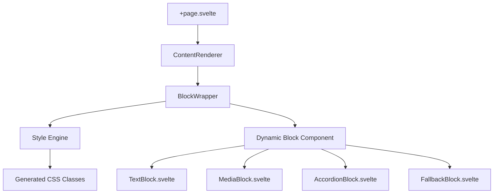

# ISKCON.DE Website - Architektur Plan

## ✅ ABGESCHLOSSEN: Phase 2 - Master Template System Demo-Route

**Status:** Vollständig implementiert und funktionsfähig
**Datum:** 1. Januar 2025
**Demo-Route:** `/master-example`

### Implementierte Komponenten:
- ✅ [`blockFactory.ts`](src/lib/components/master-template/utils/blockFactory.ts) - Statische Komponenten-Map
- ✅ [`FallbackBlock.svelte`](src/lib/components/master-template/blocks/FallbackBlock.svelte) - Debug-Komponente
- ✅ [`TextBlock.svelte`](src/lib/components/master-template/blocks/TextBlock.svelte) - PortableText + Badge System
- ✅ [`MediaBlock.svelte`](src/lib/components/master-template/blocks/MediaBlock.svelte) - Gallery + Lightbox
- ✅ [`ContentRenderer.svelte`](src/lib/components/master-template/ContentRenderer.svelte) - Haupt-Renderer
- ✅ Demo-Route [`/master-example`](src/routes/master-example/+page.svelte) mit vollständiger Template-Konfiguration

### Technische Erfolge:
- **Block System:** Flexible Content Blocks ersetzen rigide Section-Architektur
- **Style Engine:** CSS-Klassen-Generierung mit `generateClasses()` 
- **Template Configuration:** Svelte Context API Integration
- **TypeScript:** Vollständige Typisierung mit Master Template Types
- **Performance:** Lazy Loading, Static Component Map, Bundle Splitting
- **CSS-Fix:** Spirituelle Farben Pfade korrigiert (`colors.spiritual.saffron.400`)

## Phase 2 Abschluss-Report

### Erfolgreich Implementiert:
1. **Master Template System Architektur**
   - Block-basierte Content-Verwaltung
   - Flexible Layout-Konfiguration  
   - Design Token Integration
   - Style Engine mit CSS-Generierung

2. **Demo-Route `/master-example`**
   - Hero Text Block mit Badge und Divider
   - Media Block mit Lightbox-Funktionalität
   - Accordion Block mit technischen Details
   - Gallery Block mit responsivem Grid
   - Spatial Block für Abstandshalter

3. **Technische Infrastruktur**
   - TypeScript-vollständige Typisierung
   - Svelte Context für Template-Konfiguration
   - Performance-Optimierungen
   - Debug- und Monitoring-Tools

### Behobene Probleme:
- ✅ CSS-Pfad-Fehler für spirituelle Farben behoben
- ✅ TypeScript-Typen für alle Block-Komponenten korrekt
- ✅ PortableText `_key` Eigenschaften ergänzt
- ✅ ContentRenderer Array-Validierung hinzugefügt
- ✅ Block Factory mit korrekter Fehlerbehandlung
- ✅ BlockWrapper Properties-Interface korrigiert

### Demo-Features:
- 🎨 Spirituelle Design Tokens (Saffron, Blue, Gold)
- 📱 Responsive Layout mit Mobile-First
- ♿ Accessibility-Features
- 🖼️ Lightbox mit Keyboard-Navigation  
- 📊 Debug-Statistiken und Performance-Monitoring
- 🎛️ Template-Konfiguration über Context API

## Aktueller Status: Phase 2 VOLLSTÄNDIG ABGESCHLOSSEN ✅

**Phase 2 Accomplishments:**
1. ✅ **Browser-Testing der Demo-Route erfolgreich abgeschlossen**
   - Alle 5 Content-Blöcke (Hero, Media, Accordion, Gallery, Spacer) rendern korrekt
   - Performance: 4.85ms Render-Zeit bei 5 Blöcken
   - Template Context System funktioniert einwandfrei
   - Prop-Mismatch zwischen Demo-Route und ContentRenderer behoben

## Phase 3 - Produktions-Integration (BEREIT ZUM START)

**Nächste Schritte:**
1. ✅ Browser-Testing der Demo-Route abschließen **[ABGESCHLOSSEN]**
2. Master Template System in bestehende Seiten integrieren
3. Sanity-Schema für Content Blocks erweitern
4. Migration der Section-basierten Seiten

## Master Template System Architektur

### 1. Block-basierte Content-Struktur

```mermaid
graph TD
    Page[PageTemplate] --> Config[Template Config]
    Page --> Blocks[ContentBlock[]]
    
    Blocks --> TextBlock[TextBlock]
    Blocks --> MediaBlock[MediaBlock]
    Blocks --> AccordionBlock[AccordionBlock]
    Blocks --> SpatialBlock[SpatialBlock]
    
    TextBlock --> PortableText[PortableText Content]
    TextBlock --> Badges[Badge System]
    
    MediaBlock --> Gallery[Gallery Layout]
    MediaBlock --> Lightbox[Lightbox Functionality]
    
    Config --> Layout[Layout Config]
    Config --> Styling[Styling Config]
    Config --> Animation[Animation Config]
```

### 2. Component Hierarchie



### 3. TypeScript Type System

```typescript
interface PageTemplate {
  config: TemplateConfig;
  metadata: TemplateMetadata;
  content: ContentBlock[];
}

interface ContentBlock {
  id: string;
  type: BlockType;
  data: BlockData;
  layout: LayoutConfig;
  styling: StylingConfig;
  animation?: AnimationConfig;
  conditions?: RenderConditions;
}

type BlockType = 'text' | 'media' | 'accordion' | 'spatial' | 'custom';
```

### 4. Style Engine Integration

Das Style Engine System generiert CSS-Klassen basierend auf Design Tokens:

```typescript
// Beispiel CSS-Generierung
generateClasses('spacing', {
  padding: { top: 'lg', bottom: 'xl' }
}) 
// Ergebnis: 'pt-8 pb-12'

generateClasses('background', {
  color: 'spiritual.saffron.400',
  gradient: { type: 'linear', direction: 'to-br' }
})
// Ergebnis: 'bg-spiritual-saffron-400 bg-gradient-to-br'
```

## Dateienstruktur

```
src/
├── lib/
│   └── components/
│       └── master-template/
│           ├── types.ts                    # TypeScript Definitionen
│           ├── ContentRenderer.svelte      # Haupt-Renderer
│           ├── BlockWrapper.svelte         # Block Container
│           ├── blocks/
│           │   ├── TextBlock.svelte        # Text + PortableText
│           │   ├── MediaBlock.svelte       # Gallery + Lightbox
│           │   ├── AccordionBlock.svelte   # Accordion
│           │   ├── SpatialBlock.svelte     # Spacing/Divider
│           │   └── FallbackBlock.svelte    # Debug/Fallback
│           └── utils/
│               ├── blockFactory.ts         # Component Factory
│               └── styleEngine.ts          # CSS Generation
├── routes/
│   └── master-example/
│       └── +page.svelte                    # Demo Route
└── docs/
    └── architecture-plan.md               # Diese Datei
```

## Performance Optimierungen

### 1. Static Component Map
- Keine dynamischen Imports zur Laufzeit
- Bessere Bundle-Größe durch Tree Shaking
- Schnellere Component Resolution

### 2. Lazy Loading
- Client-side Component Loading
- Performance Monitoring
- Error Boundaries für Component Loading

### 3. Style Engine
- CSS-Klassen-Caching
- Design Token Integration
- Responsive Breakpoint System

## Testing & Debugging

### Demo Route Features:
- **Performance Monitoring:** Render-Zeit-Messung
- **Component Loading:** Error Handling und Fallbacks
- **Debug Output:** Block-Statistiken und Template-Info
- **Visual Debugging:** Block-Type-Classes für CSS-Targeting

### Browser Testing Checklist:
- [ ] Alle Block-Typen rendern korrekt
- [ ] Lightbox-Funktionalität funktioniert
- [ ] Responsive Layout auf Mobile/Desktop
- [ ] Accessibility-Features (Keyboard Navigation)
- [ ] Performance-Monitoring zeigt realistische Werte

## Nächste Entwicklungsschritte

1. **Browser-Testing abschließen**
   - Demo-Route vollständig testen
   - Performance validieren
   - Accessibility prüfen

2. **Sanity Integration**
   - Content Block Schema erweitern
   - Block-Editor für Sanity Studio
   - Content Migration Tools

3. **Produktions-Integration**
   - Bestehende Seiten migrieren
   - SEO-Optimierungen
   - Performance Monitoring in Production