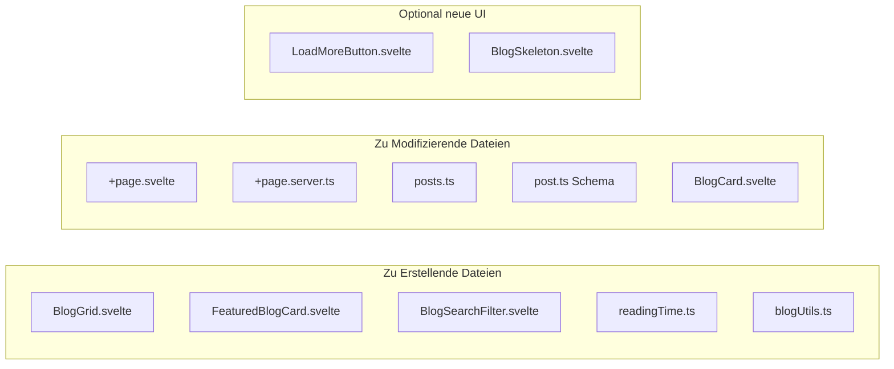

# 🏗️ **IMPLEMENTIERUNGSPLAN: Blog-System Erweiterung**
## Moderne Übersichtsseite mit Featured Posts und Grid-Layout

### 📋 **Projektübersicht**

**Ziel:** Erweiterung des bestehenden Blog-Systems um moderne Features für eine verbesserte Benutzererfahrung.

**Gewählte Features:**
- ✅ Featured Post als erste, größere Karte im Grid integriert
- ✅ 12 Posts initial + "Load More" Button  
- ✅ Kategorien-Filter + Real-time Suche + Automatische Lesezeit
- ✅ Modernes responsives Grid-Layout
- ✅ Skeleton Loading für optimale UX

---

### 🏛️ **System-Architektur**

```mermaid
graph TB
    subgraph "Frontend Components"
        A[+page.svelte] --> B[BlogGrid.svelte]
        B --> C[FeaturedBlogCard.svelte]
        B --> D[BlogCard.svelte - Enhanced]
        A --> E[BlogSearchFilter.svelte]
        E --> F[SearchInput.svelte]
        E --> G[CategoryFilter.svelte]
    end
    
    subgraph "Data Layer"
        H[+page.server.ts] --> I[Enhanced Queries]
        I --> J[getFeaturedPost()]
        I --> K[getRegularPosts()]
        I --> L[getCategories()]
    end
    
    subgraph "Sanity Backend"
        M[Post Schema] --> N[Add isFeatured Field]
        O[New Queries] --> P[Featured Post Logic]
        O --> Q[Pagination Support]
    end
    
    subgraph "Utilities"
        R[readingTime.ts] --> S[Calculate Reading Time]
        T[blogUtils.ts] --> U[Filter Logic]
    end
    
    A --> H
    I --> M
    B --> R
    E --> T
```

---

### 📁 **Dateien-Struktur & Implementierung**



---

### 🔧 **Implementierungsschritte**

#### **Phase 1: Sanity Schema Update**

**Datei:** `studio-iskcon.de/schemas/post.ts`

```typescript
// Neues Feld hinzufügen:
{
  name: 'isFeatured',
  title: 'Als Featured Post markieren',
  type: 'boolean',
  description: 'Wird dieser Post als Featured Post angezeigt?',
  initialValue: false
}
```

#### **Phase 2: Enhanced Queries**

**Datei:** `src/lib/sanity/queries/posts.ts`

```typescript
// Neue Funktionen:
export async function getFeaturedPost(): Promise<SanityPost | null> {
  // 1. Suche nach isFeatured=true Posts
  // 2. Fallback: Neuester Post
}

export async function getRegularPosts(
  limit = 12, 
  offset = 0, 
  category?: string, 
  search?: string
): Promise<SanityPost[]> {
  // Pagination + Filter Support
}

export async function getPostCategories(): Promise<SanityCategory[]> {
  // Für Filter-Dropdown
}
```

#### **Phase 3: Neue Komponenten**

**1. BlogGrid.svelte**
```svelte
<!-- Responsive CSS Grid -->
<!-- Featured Post: 2 Spalten, Regular: 1 Spalte -->
<!-- Load More Funktionalität -->
<!-- Skeleton Loading States -->
```

**2. FeaturedBlogCard.svelte**
```svelte
<!-- Größeres Layout (aspect-ratio: 16/9) -->
<!-- Prominent "Featured" Badge -->
<!-- Enhanced Typography -->
```

**3. BlogSearchFilter.svelte**
```svelte
<!-- Real-time Search Input -->
<!-- Category Dropdown Filter -->
<!-- Clear Filters Button -->
```

#### **Phase 4: Utilities**

**1. readingTime.ts**
```typescript
export function calculateReadingTime(content: SanityBlock[]): number {
  const wordsPerMinute = 200;
  const wordCount = extractTextFromBlocks(content).split(' ').length;
  return Math.ceil(wordCount / wordsPerMinute);
}
```

**2. blogUtils.ts**
```typescript
// Filter Logik
// Search Funktionalität  
// Post Sorting
```

#### **Phase 5: UI Enhancements**

**BlogCard.svelte Updates:**
- Lesezeit-Anzeige hinzufügen
- Verbesserte Hover-Effekte
- Better Accessibility

---

### 🎨 **Design Spezifikationen**

#### **Featured Post Card:**
- **Größe:** 2x Regular Card Breite (Desktop)
- **Aspect Ratio:** 16:9
- **Badge:** "Featured" mit spiritual-saffron Akzent
- **Typography:** Größere Schrift für Titel

#### **Regular Post Grid:**
- **Responsive:** 1/2/3 Spalten (Mobile/Tablet/Desktop)
- **Consistent Card Height:** durch CSS Grid
- **Smooth Hover-Animationen**

#### **Filter & Search:**
- **Sticky Header** beim Scrollen
- **Real-time Debounced Search** (300ms)
- **Category Pills** mit Count Anzeige

---

### 📱 **Responsive Breakpoints**

```css
/* Mobile First Approach */
.blog-grid {
  display: grid;
  gap: 1.5rem;
  grid-template-columns: 1fr;
}

/* Tablet: 768px+ */
@media (min-width: 768px) {
  .blog-grid {
    grid-template-columns: repeat(2, 1fr);
  }
  .featured-post {
    grid-column: 1 / -1;
  }
}

/* Desktop: 1024px+ */
@media (min-width: 1024px) {
  .blog-grid {
    grid-template-columns: repeat(3, 1fr);
    gap: 2rem;
  }
  .featured-post {
    grid-column: span 2;
  }
}
```

---

### ⚡ **Performance Optimierungen**

#### **1. Lazy Loading:**
- Images mit `loading="lazy"`
- Intersection Observer für Load More

#### **2. Skeleton Loading:**
- Während Initial Load
- Während Load More
- Während Search/Filter

#### **3. Debounced Search:**
- 300ms Delay für Real-time Search
- Cancel Previous Requests

---

### 🧪 **Testing Strategy**

#### **1. Functionality Tests:**
- Featured Post Selection Logic
- Search & Filter Funktionalität
- Load More Pagination
- Reading Time Calculation

#### **2. Performance Tests:**
- Initial Load Speed
- Search Response Time
- Memory Usage bei Load More

#### **3. Responsive Tests:**
- Mobile/Tablet/Desktop Layouts
- Touch Interactions
- Accessibility (Screen Reader)

---

### 📝 **Implementierungsreihenfolge**

1. **Sanity Schema Update** → Deploy to Studio
2. **Backend Queries** → Enhanced posts.ts
3. **Utility Functions** → readingTime.ts, blogUtils.ts
4. **Core Components** → BlogGrid, FeaturedBlogCard
5. **Filter System** → BlogSearchFilter
6. **Page Integration** → +page.svelte, +page.server.ts
7. **UI Polish** → Enhanced BlogCard, Skeleton Loading
8. **Testing & Optimization**

---

### 🎯 **Erfolgskriterien**

- ✅ Featured Post System funktional
- ✅ Responsive Grid-Layout auf allen Geräten
- ✅ Real-time Search unter 300ms Response
- ✅ Load More ohne Performance-Einbußen
- ✅ Automatische Lesezeit-Berechnung
- ✅ Accessibility Score > 95%
- ✅ Mobile Performance Score > 90%

---

**Erstellt am:** 29. Juni 2025  
**Status:** Bereit für Implementierung  
**Geschätzte Umsetzungszeit:** 2-3 Entwicklungstage