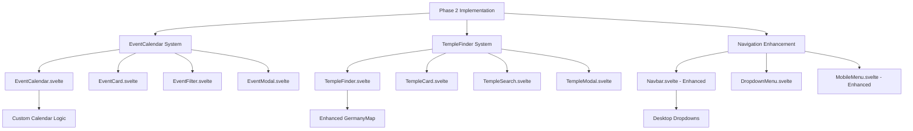
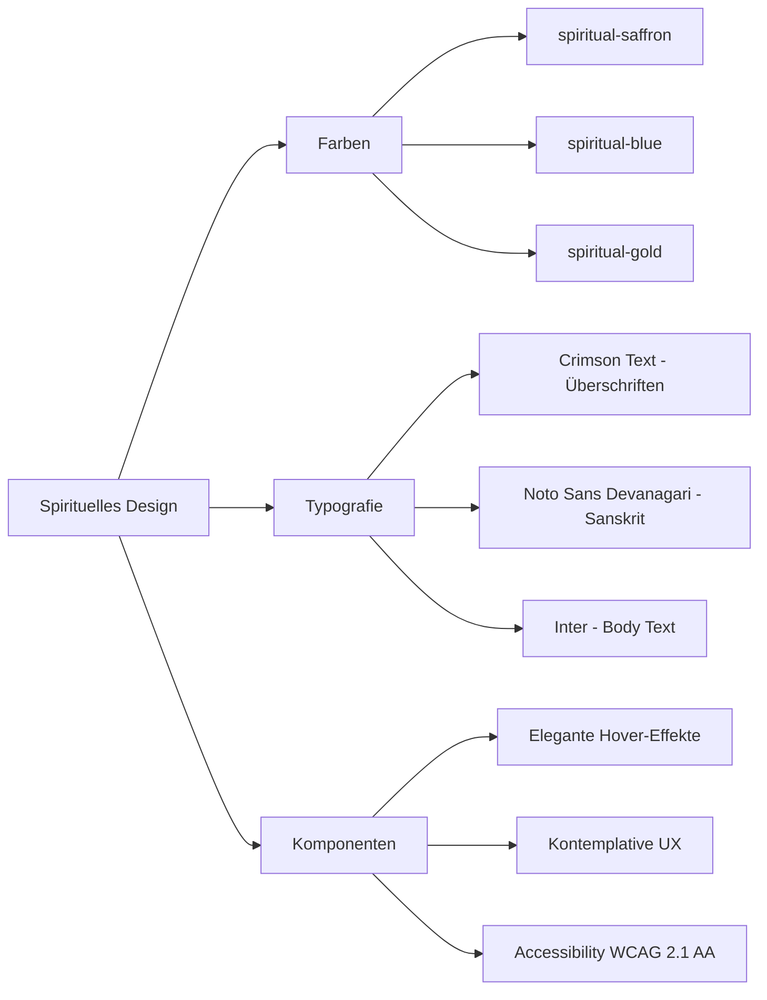
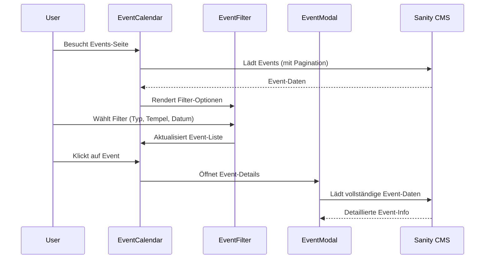
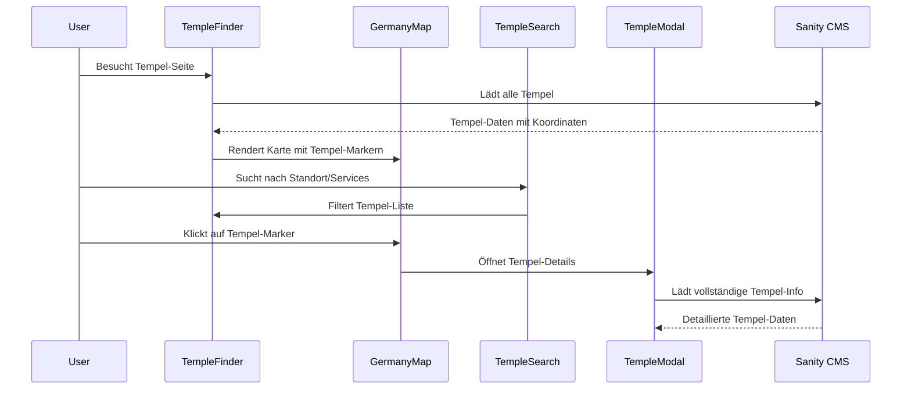

# 🏗️ ISKCON.de Phase 2 - Implementierungsplan
## Kern-Features: EventCalendar, TempleFinder & Navigation

---

## 📋 Überblick

Phase 2 der ISKCON.de Website-Erweiterung implementiert die drei Kern-Features: **EventCalendar**, **TempleFinder** und **erweiterte Navigation**. Die Lösung baut optimal auf der bestehenden SvelteKit + Sanity CMS + Tailwind CSS Architektur auf.

## 🎯 Strategische Entscheidungen

### **EventCalendar**: Custom Svelte-Lösung
- **Warum**: Perfekte Integration ins spirituelle Design-System
- **Vorteil**: Volle Kontrolle, keine externen Abhängigkeiten, optimale Performance
- **Features**: Monats-/Listen-Ansicht, Filtering, Lazy-Loading, Accessibility

### **TempleFinder**: Erweiterung der GermanyMap
- **Warum**: Bestehende Komponente ist bereits excellent strukturiert
- **Vorteil**: Konsistenz, bewährte UX, einfache Erweiterung um Österreich/Schweiz später
- **Features**: Interaktive Marker, Such-/Filter-Funktionen, Tempel-Details

### **Navigation**: Erweiterte Dropdown-Funktionalität
- **Warum**: Bestehende Mobile-Navigation ist bereits gut implementiert
- **Vorteil**: Konsistente UX, erweiterte Desktop-Features hinzufügen
- **Features**: Mega-Menüs, spirituelle Animationen, Accessibility

## 🗂️ Komponenten-Architektur



## 📁 Dateistruktur Plan

```
src/lib/components/
├── sections/
│   ├── EventCalendar.svelte        # ✨ NEU - Hauptkalender
│   ├── EventCard.svelte            # ✨ NEU - Event-Karten
│   ├── EventFilter.svelte          # ✨ NEU - Filter-Komponente
│   ├── EventModal.svelte           # ✨ NEU - Event-Details Modal
│   ├── TempleFinder.svelte         # ✨ NEU - Erweiterte Karte
│   ├── TempleCard.svelte           # ✨ NEU - Tempel-Karten
│   ├── TempleSearch.svelte         # ✨ NEU - Such-Funktionalität
│   ├── TempleModal.svelte          # ✨ NEU - Tempel-Details Modal
│   └── GermanyMap.svelte           # 🔄 ERWEITERT - Temple-Integration
├── global/
│   ├── Navbar.svelte               # 🔄 ERWEITERT - Desktop Dropdowns
│   ├── DropdownMenu.svelte         # ✨ NEU - Dropdown-Komponente
│   └── MobileMenu.svelte           # ✨ NEU - Enhanced Mobile Menu

src/routes/
├── events/
│   ├── +page.svelte                # ✨ NEU - Events-Übersicht
│   └── +page.server.ts             # ✨ NEU - Event-Queries
└── tempel/
    ├── +page.svelte                # ✨ NEU - Tempel-Finder
    └── +page.server.ts             # ✨ NEU - Tempel-Queries

src/lib/sanity/
└── queries.ts                      # 🔄 ERWEITERT - Event/Temple Queries
```

## 🎨 Design-System Integration



## 🔄 Implementierungs-Phasen

### **Phase 2.1: EventCalendar System** (Erste Priorität)



#### Komponenten-Details:

**1. EventCalendar.svelte**
- Monats-/Listen-Ansicht Toggle
- Responsive Grid für Event-Karten
- Lazy-Loading für Performance
- Pagination für große Event-Listen
- Spirituelles Design mit saffron/blue Akzenten

**2. EventCard.svelte**
- Event-Typ Icons und Badges
- Datum/Zeit Anzeige mit spiritueller Typografie
- Tempel-Referenz mit Link
- Call-to-Action für Details/Anmeldung
- Hover-Effekte mit spiritual-gold Akzenten

**3. EventFilter.svelte**
- Multi-Select für Event-Typen (Festival, Kirtan, Vortrag, etc.)
- Tempel-Dropdown mit Autocomplete
- Datums-Range Picker
- Tags-Filter
- Reset-Funktionalität
- URL-State Integration für Bookmarks

**4. EventModal.svelte**
- Vollbild-Overlay mit Event-Details
- Anmelde-Integration (Registration-Link)
- Kontakt-Informationen des Veranstalters
- Wegbeschreibung zu Tempel/Veranstaltungsort
- Social Sharing (WhatsApp, Email, etc.)
- Accessibility-konform (ESC-close, Focus-trap)

### **Phase 2.2: TempleFinder System** (Zweite Priorität)



#### Komponenten-Details:

**1. TempleFinder.svelte**
- Integration der erweiterten GermanyMap
- Such-/Filter-Sidebar
- Tempel-Liste parallel zur Karte
- Responsive Layout (Karte oben auf Mobile)
- Spirituelle Gestaltung mit earth-Tönen

**2. Enhanced GermanyMap.svelte**
- Tempel-spezifische Marker (Lotus-Icons in spiritual-saffron)
- Hover-Effekte mit Tempel-Preview
- Clustering für dichte Bereiche
- Zoom-to-fit Funktionalität
- Performance-optimiert für viele Marker

**3. TempleSearch.svelte**
- Geografische Suche (PLZ, Stadt, Umkreis)
- Service-Filter (Restaurant, Bibliothek, Gästehaus, etc.)
- Entfernungs-basierte Sortierung
- Öffnungszeiten-Filter ("Jetzt geöffnet")
- Accessibility-konforme Formular-Elemente

**4. TempleCard.svelte**
- Tempel-Foto mit spirituellem Rahmen
- Grundinformationen (Name, Stadt, Services)
- Öffnungszeiten-Anzeige (heute hervorgehoben)
- Service-Icons in spiritual-blue
- Entfernung (wenn Standort verfügbar)
- Direkter Link zu Details und Wegbeschreibung

**5. TempleModal.svelte**
- Vollständige Tempel-Information
- Bildergalerie mit Lightbox
- Programme und Öffnungszeiten-Tabelle
- Kontakt und Wegbeschreibung
- Aktuelle Events im Tempel
- Social Media Links
- Google Maps Integration

### **Phase 2.3: Navigation Enhancement** (Dritte Priorität)

#### Erweiterte Navigation-Features:

**1. Enhanced Navbar.svelte**
- Desktop-Dropdown-Menüs hinzufügen
- Mega-Menu für "Tempel & Zentren" mit Karten-Preview
- Events-Dropdown mit Featured Events
- Bessere Accessibility (ARIA-Labels, Keyboard-Navigation)
- Spiritual Hover-Animationen mit saffron-Akzenten
- Sticky-Navigation mit Scroll-Detection

**2. DropdownMenu.svelte**
- Spirituelle Dropdown-Gestaltung
- Smooth Animations (fade + slide)
- Multi-Level-Support
- Keyboard-Navigation (Arrow-Keys, Enter, ESC)
- Auto-close auf außen-Klick
- Mobile-responsive Fallback

**3. Enhanced MobileMenu.svelte**
- Events & Tempel Integration in bestehende Struktur
- Schnell-Zugriff auf Filter
- Spirituelle Navigation-Icons
- Improved Touch-Gestures
- Better Performance (Virtual Scrolling bei langen Listen)

## 🔍 Sanity Queries Erweiterungen

```typescript
// Event Queries
export const eventQueries = {
  // Alle Events mit Filtering
  getAllEvents: `*[_type == "event" && isPublished == true] | order(startDate asc) {
    title,
    'slug': slug.current,
    description,
    startDate,
    endDate,
    eventType,
    'featuredImage': featuredImage.asset->url,
    'temple': location.temple-> {
      name,
      'slug': slug.current,
      'address': address
    },
    isFeatured,
    tags,
    registration {
      required,
      deadline,
      registrationLink,
      cost
    }
  }`,
  
  // Events für Kalender (mit Recurrence)
  getCalendarEvents: `*[_type == "event" && isPublished == true && startDate >= now()] {
    title,
    startDate,
    endDate,
    eventType,
    isRecurring,
    recurrencePattern,
    'temple': location.temple->name,
    'color': eventType
  }[0...100]`,
  
  // Featured Events für Homepage
  getFeaturedEvents: `*[_type == "event" && isFeatured == true && isPublished == true && startDate >= now()] | order(startDate asc)[0...6] {
    title,
    'slug': slug.current,
    startDate,
    eventType,
    'featuredImage': featuredImage.asset->url,
    'temple': location.temple->name
  }`,

  // Event Details
  getEventBySlug: `*[_type == "event" && slug.current == $slug][0] {
    title,
    description,
    longDescription,
    'featuredImage': featuredImage.asset->url,
    startDate,
    endDate,
    eventType,
    location,
    organizer,
    registration,
    tags,
    seo
  }`
};

// Temple Queries  
export const templeQueries = {
  // Alle aktiven Tempel für Karte
  getAllTemples: `*[_type == "temple" && isActive == true] | order(name asc) {
    name,
    'slug': slug.current,
    description,
    'mainImage': mainImage.asset->url,
    address,
    location,
    contact,
    serviceHours,
    facilities,
    featuredOnHomepage,
    programs[] {
      title,
      time,
      frequency
    }
  }`,
  
  // Tempel-Details
  getTempleBySlug: `*[_type == "temple" && slug.current == $slug][0] {
    name,
    description,
    'mainImage': mainImage.asset->url,
    'gallery': gallery[].asset->url,
    address,
    location,
    contact,
    serviceHours,
    programs,
    facilities,
    president,
    seo
  }`,

  // Featured Tempel für Homepage
  getFeaturedTemples: `*[_type == "temple" && featuredOnHomepage == true && isActive == true][0...4] {
    name,
    'slug': slug.current,
    'mainImage': mainImage.asset->url,
    'city': address.city,
    facilities
  }`
};

// Navigation Queries
export const navigationQueries = {
  // Events für Navigation
  getNavEvents: `*[_type == "event" && isFeatured == true && startDate >= now()] | order(startDate asc)[0...3] {
    title,
    'slug': slug.current,
    startDate,
    eventType
  }`,
  
  // Tempel für Navigation
  getNavTemples: `*[_type == "temple" && featuredOnHomepage == true] | order(name asc)[0...5] {
    name,
    'slug': slug.current,
    'city': address.city
  }`
};
```

## 🎯 Technische Implementierungs-Details

### **Performance-Optimierungen:**
- **Lazy Loading**: Events und Tempel-Daten mit Intersection Observer
- **Image Optimization**: Sanity CDN mit responsiven Breakpoints
- **Code Splitting**: Route-basierte Komponenten-Trennung
- **Caching**: Server-side Queries mit SvelteKit Load Functions
- **Virtual Scrolling**: Für große Event-/Tempel-Listen
- **Preloading**: Critical Resources mit rel="preload"

### **Accessibility (WCAG 2.1 AA):**
- **Keyboard Navigation**: Alle interaktiven Elemente erreichbar
- **Screen Reader**: Semantische HTML-Struktur und ARIA-Labels
- **Color Contrast**: Spirituelle Farben mit mindestens 4.5:1 Kontrast
- **Focus Management**: Sichtbare Focus-Indikatoren in spiritual-saffron
- **Alternative Text**: Für alle Bilder und Icons
- **Skip Links**: Für Haupt-Navigation

### **Mobile-First Design:**
- **Responsive Breakpoints**: Tailwind CSS System (sm:, md:, lg:, xl:)
- **Touch-Optimized**: Mindestens 44px Touch-Targets
- **Performance**: Optimiert für langsamere Verbindungen
- **Gestures**: Swipe-Navigation für Kalender und Gallerien
- **Viewport**: Optimiert für verschiedene Bildschirmgrößen

### **Spirituelles Design-System:**
- **Farben**: Konsequente Verwendung von spiritual-saffron/blue/gold
- **Typografie**: Sanskrit-freundliche Schriften (Noto Sans Devanagari)
- **Animationen**: Sanfte, kontemplative Übergänge
- **Icons**: Spirituelle Symbolik (Lotus, Om, etc.)
- **Layout**: Harmonische Proportionen und Weißraum

## 🚀 Rollout-Strategie

### **Woche 1-2: Phase 2.1 - EventCalendar System**
1. EventCalendar.svelte - Grundstruktur und Kalender-Logic
2. EventCard.svelte - Spirituelles Card-Design
3. EventFilter.svelte - Filtering und URL-State
4. EventModal.svelte - Detail-Ansicht und Accessibility
5. Events-Route (/events) - Server-side Queries
6. Sanity Queries - Event-spezifische Abfragen

### **Woche 3-4: Phase 2.2 - TempleFinder System**
1. TempleFinder.svelte - Haupt-Container und Layout
2. Enhanced GermanyMap.svelte - Tempel-Marker Integration
3. TempleSearch.svelte - Such- und Filter-Funktionalität
4. TempleCard.svelte - Tempel-Karten Design
5. TempleModal.svelte - Detail-Ansicht mit Maps-Integration
6. Tempel-Route (/tempel) - Server-side Queries

### **Woche 5: Phase 2.3 - Navigation Enhancement**
1. Enhanced Navbar.svelte - Desktop-Dropdowns
2. DropdownMenu.svelte - Wiederverwendbare Dropdown-Komponente
3. Enhanced MobileMenu.svelte - Mobile Verbesserungen
4. Navigation-Integration - Events/Tempel in Menüs
5. Accessibility-Testing - Keyboard und Screen Reader

### **Woche 6: Testing & Refinement**
1. Cross-Browser Testing (Chrome, Firefox, Safari, Edge)
2. Mobile Device Testing (iOS, Android)
3. Performance Optimization (Lighthouse Scores)
4. Accessibility Audit (WCAG 2.1 AA)
5. User Experience Testing
6. Bug Fixes und Final Polish

## 🔄 Integration mit bestehenden Features

### **Homepage Integration:**
- Featured Events in bestehenden Slider
- Featured Tempel in Deutschland-Karte
- Navigation-Updates für neue Routen

### **SEO Optimierung:**
- Meta-Tags für Event- und Tempel-Seiten
- Structured Data (JSON-LD) für Events
- Sitemap-Updates
- Open Graph Tags für Social Sharing

### **Analytics Integration:**
- Event-Tracking für Kalender-Interaktionen
- Tempel-Suche Analytics
- Navigation-Nutzung Tracking
- Conversion-Tracking für Event-Anmeldungen

---

## ✅ Erfolgskriterien

### **Funktionale Kriterien:**
- ✅ Events können nach Typ, Datum, Tempel gefiltert werden
- ✅ Kalender zeigt Events in Monats- und Listen-Ansicht
- ✅ Tempel können geographisch gesucht und gefiltert werden
- ✅ Karte zeigt alle Tempel mit interaktiven Markern
- ✅ Navigation ist intuitiv und accessibility-konform
- ✅ Mobile Nutzererfahrung ist optimiert

### **Technische Kriterien:**
- ✅ Lighthouse Score > 90 (Performance, Accessibility, SEO)
- ✅ WCAG 2.1 AA Compliance
- ✅ Responsive Design funktioniert auf allen Geräten
- ✅ Keine JavaScript-Fehler in Browser-Konsole
- ✅ Fast Loading Times (< 3s auf 3G)

### **Design Kriterien:**
- ✅ Konsistente Verwendung des spirituellen Design-Systems
- ✅ Harmonische Integration in bestehende Website
- ✅ Intuitive Benutzerführung
- ✅ Ästhetisch ansprechende Darstellung

---

*Dieser Plan bildet die Grundlage für die Implementierung der Phase 2 Kern-Features der ISKCON.de Website. Alle Komponenten werden mit spiritueller Ästhetik, Performance-Optimierung und Accessibility im Fokus entwickelt.*