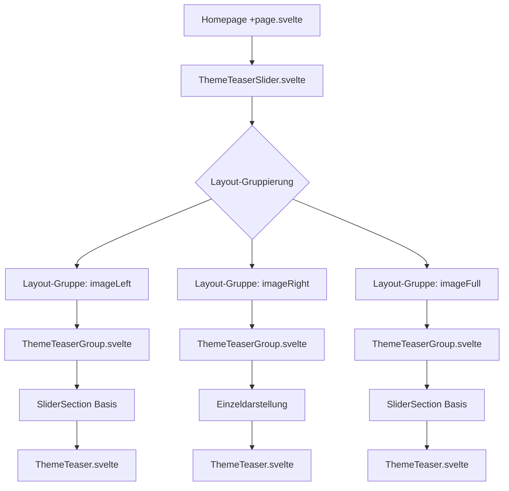
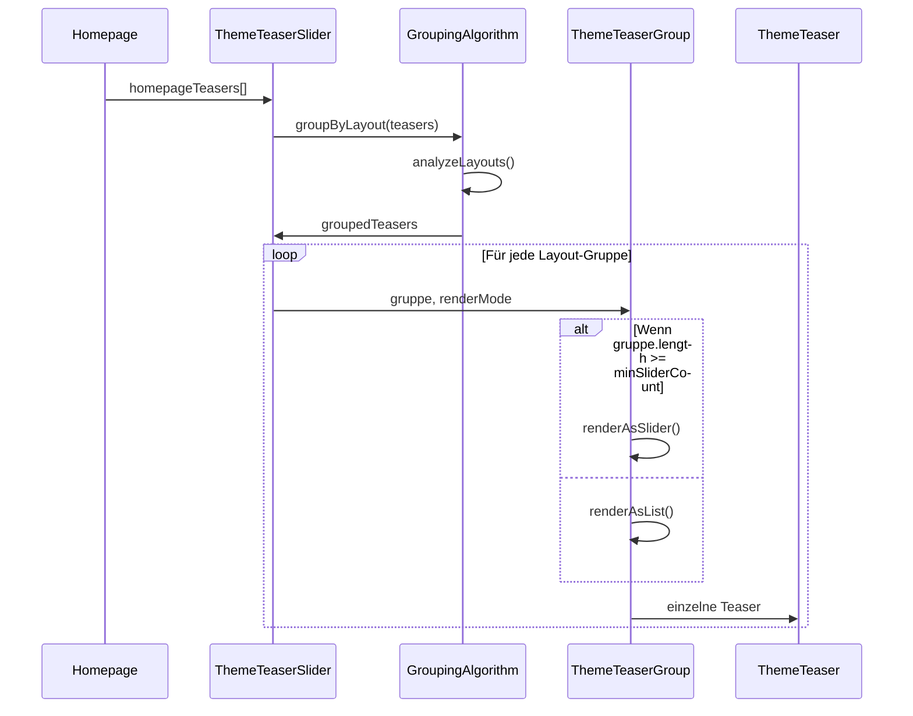

# 📋 Technische Spezifikation: ThemeTeaser Slider-Funktionalität

## 🎯 Hauptziel

Entwicklung einer intelligenten Container-Komponente `ThemeTeaserSlider.svelte`, die automatisch ThemeTeaser-Objekte nach Layout-Typ gruppiert und bei mehreren ThemeTeasern gleichen Layouts diese in einem Slider anstatt untereinander anzeigt.

## 🏗️ Komponenten-Architektur



## 📊 Datenfluss-Diagramm



## 🧩 Neue Komponenten-Spezifikation

### 1. ThemeTeaserSlider.svelte

**Zweck**: Haupt-Container für intelligente Layout-Gruppierung

**Props**:
```typescript
interface ThemeTeaserSliderProps {
  teasers: SanityHomepageTeaser[];
  minSliderCount?: number; // Standard: 2
  enableGrouping?: boolean; // Standard: true
  fallbackToList?: boolean; // Standard: true
  groupSpacing?: 'compact' | 'normal' | 'spacious'; // Standard: 'normal'
}
```

**Algorithmus**:
```typescript
// Layout-Gruppierung Algorithmus
function groupTeasersByLayout(teasers: SanityHomepageTeaser[]): LayoutGroup[] {
  const groups = new Map<LayoutType, SanityHomepageTeaser[]>();
  
  // Gruppierung nach Layout-Typ
  teasers.forEach(teaser => {
    const layout = teaser.layout;
    if (!groups.has(layout)) {
      groups.set(layout, []);
    }
    groups.get(layout)!.push(teaser);
  });
  
  // Konvertierung zu LayoutGroup-Objekten
  return Array.from(groups.entries()).map(([layout, items]) => ({
    layout,
    items,
    renderMode: items.length >= minSliderCount ? 'slider' : 'list',
    sliderConfig: layout === 'imageFull' ? fullScreenSliderConfig : standardSliderConfig
  }));
}
```

### 2. ThemeTeaserGroup.svelte

**Zweck**: Rendert eine Layout-Gruppe als Slider oder Liste

**Props**:
```typescript
interface ThemeTeaserGroupProps {
  layoutGroup: LayoutGroup;
  groupIndex: number;
  totalGroups: number;
}

interface LayoutGroup {
  layout: 'imageLeft' | 'imageRight' | 'imageFull';
  items: SanityHomepageTeaser[];
  renderMode: 'slider' | 'list';
  sliderConfig?: SliderConfig;
}
```

**Slider-Konfigurationen**:
```typescript
const sliderConfigs = {
  standard: {
    itemsPerView: { mobile: 1, tablet: 1, desktop: 1 },
    spacing: 24,
    navigation: true,
    pagination: true,
    autoplay: false
  },
  imageFull: {
    itemsPerView: { mobile: 1, tablet: 1, desktop: 1 },
    spacing: 0,
    navigation: true,
    pagination: true,
    autoplay: true,
    autoplayDelay: 8000
  }
};
```

### 3. Erweiterte TypeScript-Definitionen

**Neue Types hinzufügen zu `src/lib/types.ts`**:
```typescript
// ThemeTeaser Slider Types
export type LayoutType = 'imageLeft' | 'imageRight' | 'imageFull';
export type RenderMode = 'slider' | 'list';

export interface LayoutGroup {
  layout: LayoutType;
  items: SanityHomepageTeaser[];
  renderMode: RenderMode;
  sliderConfig?: SliderConfig;
}

export interface SliderConfig {
  itemsPerView: {
    mobile: number;
    tablet: number;
    desktop: number;
  };
  spacing: number;
  navigation: boolean;
  pagination: boolean;
  autoplay: boolean;
  autoplayDelay?: number;
}

export interface ThemeTeaserSliderOptions {
  minSliderCount: number;
  enableGrouping: boolean;
  fallbackToList: boolean;
  groupSpacing: 'compact' | 'normal' | 'spacious';
}
```

## 🔧 Technische Implementation

### Layout-Gruppierungs-Algorithmus

```typescript
// src/lib/utils/themeTeaserGrouping.ts
export class ThemeTeaserGroupingEngine {
  private readonly options: ThemeTeaserSliderOptions;
  
  constructor(options: Partial<ThemeTeaserSliderOptions> = {}) {
    this.options = {
      minSliderCount: 2,
      enableGrouping: true,
      fallbackToList: true,
      groupSpacing: 'normal',
      ...options
    };
  }
  
  groupByLayout(teasers: SanityHomepageTeaser[]): LayoutGroup[] {
    if (!this.options.enableGrouping) {
      return this.createFallbackGroups(teasers);
    }
    
    // Sortierung nach order-Feld beibehalten
    const sortedTeasers = [...teasers].sort((a, b) => (a.order || 0) - (b.order || 0));
    
    // Gruppierung nach Layout
    const layoutGroups = this.groupTeasersByLayout(sortedTeasers);
    
    // Render-Modus bestimmen
    return layoutGroups.map(group => ({
      ...group,
      renderMode: this.determineRenderMode(group),
      sliderConfig: this.getSliderConfig(group.layout)
    }));
  }
  
  private determineRenderMode(group: LayoutGroup): RenderMode {
    return group.items.length >= this.options.minSliderCount ? 'slider' : 'list';
  }
  
  private getSliderConfig(layout: LayoutType): SliderConfig {
    // Layout-spezifische Slider-Konfigurationen
    const configs = {
      imageLeft: sliderConfigs.standard,
      imageRight: sliderConfigs.standard,
      imageFull: sliderConfigs.imageFull
    };
    
    return configs[layout];
  }
}
```

### Responsive Design & Touch-Gesten

**Mobile-optimierte Slider-Implementierung**:
```typescript
// Erweiterte SliderSection für ThemeTeaser
export class ThemeTeaserSlider extends SliderSection {
  private touchStartX: number = 0;
  private touchEndX: number = 0;
  private isTouch: boolean = false;
  
  protected initializeTouchHandlers(): void {
    this.container.addEventListener('touchstart', this.handleTouchStart.bind(this));
    this.container.addEventListener('touchmove', this.handleTouchMove.bind(this));
    this.container.addEventListener('touchend', this.handleTouchEnd.bind(this));
  }
  
  private handleTouchStart(e: TouchEvent): void {
    this.isTouch = true;
    this.touchStartX = e.touches[0].clientX;
  }
  
  private handleTouchEnd(e: TouchEvent): void {
    if (!this.isTouch) return;
    
    this.touchEndX = e.changedTouches[0].clientX;
    this.evaluateSwipe();
    this.isTouch = false;
  }
  
  private evaluateSwipe(): void {
    const swipeThreshold = 50;
    const swipeDistance = this.touchStartX - this.touchEndX;
    
    if (Math.abs(swipeDistance) > swipeThreshold) {
      if (swipeDistance > 0) {
        this.nextSlide();
      } else {
        this.previousSlide();
      }
    }
  }
}
```

## 🎨 CSS/Styling-Konzept

### Layout-spezifische Anpassungen

```scss
// src/lib/components/sections/homepage/ThemeTeaserSlider.svelte
.theme-teaser-slider {
  --slider-gap: 2rem;
  --transition-duration: 0.6s;
  --transition-easing: cubic-bezier(0.4, 0, 0.2, 1);
  
  &__group {
    margin-bottom: var(--group-spacing);
    
    &--compact { --group-spacing: 2rem; }
    &--normal { --group-spacing: 4rem; }
    &--spacious { --group-spacing: 6rem; }
  }
  
  &__group-header {
    // Optional: Gruppierungs-Header für bessere UX
    opacity: 0.7;
    font-size: 0.9rem;
    margin-bottom: 1rem;
  }
  
  // Layout-spezifische Slider-Anpassungen
  &--image-full {
    .slider-container {
      border-radius: 0;
      overflow: hidden;
      
      .theme-teaser {
        min-height: 60vh;
      }
    }
  }
  
  &--image-left,
  &--image-right {
    .slider-container {
      border-radius: 1rem;
      box-shadow: 0 20px 40px rgba(0, 0, 0, 0.1);
    }
  }
}
```

## ♿ Accessibility & ARIA

### Keyboard Navigation & Screen Reader

```typescript
// Accessibility-Implementierung
export interface AccessibilityConfig {
  announceSlideChanges: boolean;
  keyboardNavigation: boolean;
  focusManagement: boolean;
  reducedMotion: boolean;
}

const ariaLabels = {
  slider: 'ThemeTeaser Slider',
  slideButton: (current: number, total: number) => 
    `Slide ${current} von ${total}`,
  nextButton: 'Nächster Slide',
  prevButton: 'Vorheriger Slide',
  pauseButton: 'Autoplay pausieren',
  playButton: 'Autoplay fortsetzen'
};
```

## 📱 Performance-Optimierungen

### Lazy Loading & Image Optimization

```typescript
// Performance-Strategien
export interface PerformanceConfig {
  lazyLoading: boolean;
  imagePreloading: number; // Anzahl der Bilder zum Vorladen
  virtualScrolling: boolean; // Für sehr viele Slides
  intersectionObserver: boolean;
}

// Lazy Loading Implementation
class LazyImageLoader {
  private observer: IntersectionObserver;
  
  constructor(private options: PerformanceConfig) {
    this.initializeObserver();
  }
  
  private initializeObserver(): void {
    this.observer = new IntersectionObserver(
      this.handleIntersection.bind(this),
      { rootMargin: '50px 0px' }
    );
  }
  
  private handleIntersection(entries: IntersectionObserverEntry[]): void {
    entries.forEach(entry => {
      if (entry.isIntersecting) {
        this.loadImage(entry.target as HTMLImageElement);
        this.observer.unobserve(entry.target);
      }
    });
  }
}
```

## 🧪 Testing-Strategie

### Unit Tests
```typescript
// tests/ThemeTeaserGrouping.test.ts
describe('ThemeTeaserGroupingEngine', () => {
  test('should group teasers by layout type', () => {
    const teasers = mockHomepageTeasers;
    const engine = new ThemeTeaserGroupingEngine();
    const groups = engine.groupByLayout(teasers);
    
    expect(groups).toHaveLength(3); // imageLeft, imageRight, imageFull
    expect(groups[0].layout).toBe('imageLeft');
  });
  
  test('should use slider mode for groups with multiple items', () => {
    const teasers = createTeasersWithSameLayout('imageLeft', 3);
    const engine = new ThemeTeaserGroupingEngine({ minSliderCount: 2 });
    const groups = engine.groupByLayout(teasers);
    
    expect(groups[0].renderMode).toBe('slider');
  });
});
```

### Integration Tests
```typescript
// tests/integration/ThemeTeaserSlider.integration.test.ts
describe('ThemeTeaserSlider Integration', () => {
  test('should render slider for grouped layouts', async () => {
    const { component } = render(ThemeTeaserSlider, {
      props: { teasers: mockTeasers }
    });
    
    expect(screen.getByRole('region', { name: /slider/i })).toBeInTheDocument();
  });
});
```

## 🔄 Integration in bestehende Homepage

### Minimale Änderungen in +page.svelte

```svelte
<!-- Ersetzt die aktuelle Theme Teaser Sektion (Zeilen 48-64) -->
{#if homepageTeasers && homepageTeasers.length > 0}
  <ThemeTeaserSlider 
    teasers={homepageTeasers}
    minSliderCount={2}
    enableGrouping={true}
    groupSpacing="normal"
  />
{:else if pages && pages.length > 0}
  <!-- Fallback bleibt unverändert -->
{/if}
```

### Progressive Enhancement

```typescript
// Progressive Enhancement Strategy
export class ProgressiveThemeTeaserSlider {
  private isEnhanced: boolean = false;
  
  enhance(): void {
    if (!this.supportsModernFeatures()) {
      this.renderBasicLayout();
      return;
    }
    
    this.renderEnhancedSlider();
    this.isEnhanced = true;
  }
  
  private supportsModernFeatures(): boolean {
    return !!(
      window.IntersectionObserver &&
      window.requestAnimationFrame &&
      CSS.supports('display', 'grid')
    );
  }
}
```

## 📋 Implementierungs-Roadmap

### Phase 1: Grundfunktionalität (3-4 Tage)
1. **Tag 1**: Erstellen von `ThemeTeaserSlider.svelte` und Gruppierungs-Algorithmus
2. **Tag 2**: Implementierung von `ThemeTeaserGroup.svelte` mit Basis-Slider
3. **Tag 3**: Integration in Homepage und grundlegende Tests
4. **Tag 4**: Responsive Design und Touch-Gesten

### Phase 2: Erweiterte Features (2-3 Tage)
1. **Tag 5**: Accessibility-Features und ARIA-Labels
2. **Tag 6**: Performance-Optimierungen und Lazy Loading
3. **Tag 7**: Umfassende Tests und Dokumentation

### Phase 3: Polishing (1-2 Tage)
1. **Tag 8**: Feintuning und Browser-Kompatibilität
2. **Tag 9**: Production-Ready Deployment

## 🎯 Erfolgs-Kriterien

✅ **Funktional**:
- Automatische Layout-Gruppierung funktioniert korrekt
- Slider wird nur bei ≥2 ThemeTeasern gleichen Layouts angezeigt
- Alle Theme-spezifischen Styles bleiben erhalten
- Rückwärtskompatibilität gewährleistet

✅ **Performance**:
- Lazy Loading funktioniert
- Smooth Scroll-Performance (60fps)
- Minimale Bundle-Size-Zunahme (<10%)

✅ **Accessibility**:
- WCAG 2.1 AA konform
- Keyboard-Navigation verfügbar
- Screen Reader kompatibel

✅ **UX**:
- Intuitive Touch-Gesten
- Responsive auf allen Geräten
- Progressive Enhancement

## 📁 Datei-Struktur

```
src/lib/components/sections/homepage/
├── ThemeTeaserSlider.svelte          # Haupt-Container
├── ThemeTeaserGroup.svelte           # Layout-Gruppen-Renderer
└── ThemeTeaser.svelte                # Bestehende Komponente (unverändert)

src/lib/utils/
└── themeTeaserGrouping.ts            # Gruppierungs-Algorithmus

src/lib/types.ts                      # Erweiterte TypeScript-Definitionen

tests/
├── ThemeTeaserGrouping.test.ts       # Unit Tests
└── integration/
    └── ThemeTeaserSlider.integration.test.ts  # Integration Tests
```

---

**Status**: ✅ Spezifikation abgeschlossen  
**Nächster Schritt**: Implementation in Code-Modus  
**Geschätzte Implementierungszeit**: 7-9 Arbeitstage